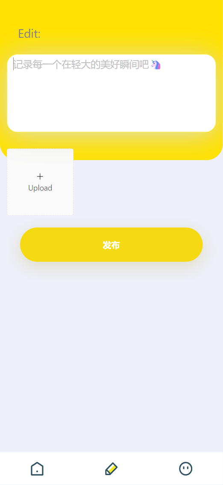

### wall
* 校园社交墙尝试
* 技术栈：React + axios + express + mongodb
* git clone https://github.com/TTTJH/wall.git
* cd wall
* cd client 
* npm i
* npm start
* 开启mongodb
* cd server 
* npm start
* 展示图如下：
* 有基础的社交功能了哦！😀😀😀
* 
* 
* 
* 
